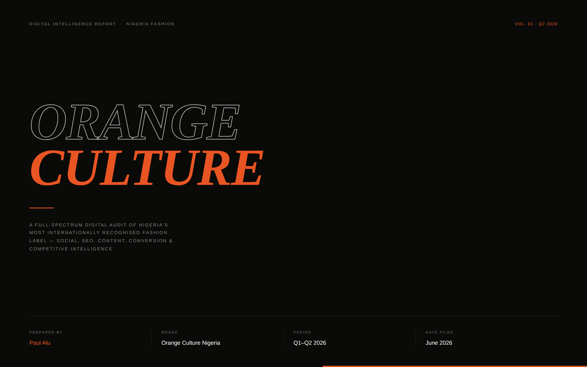
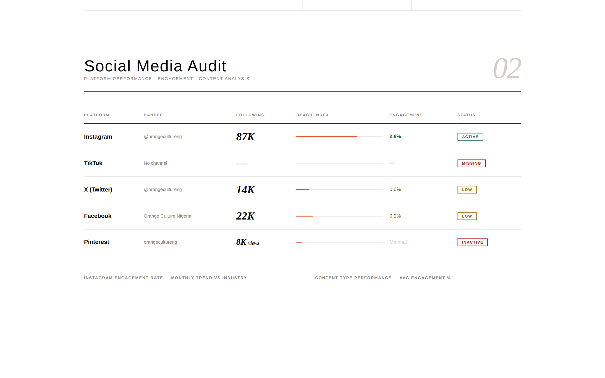
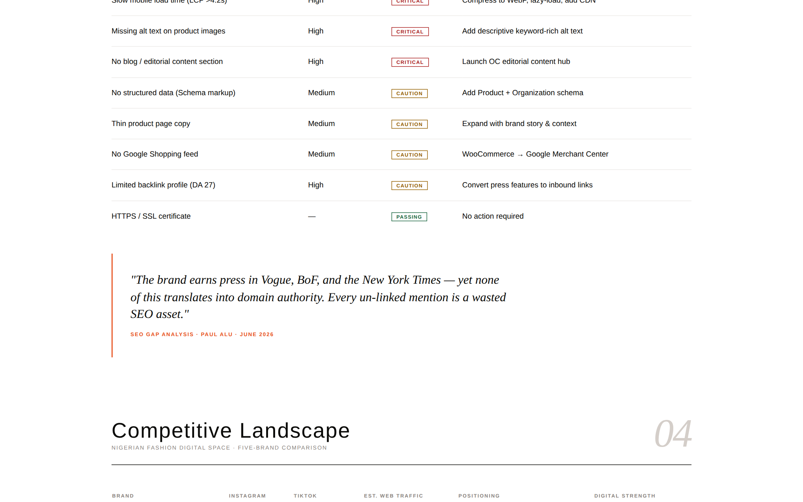
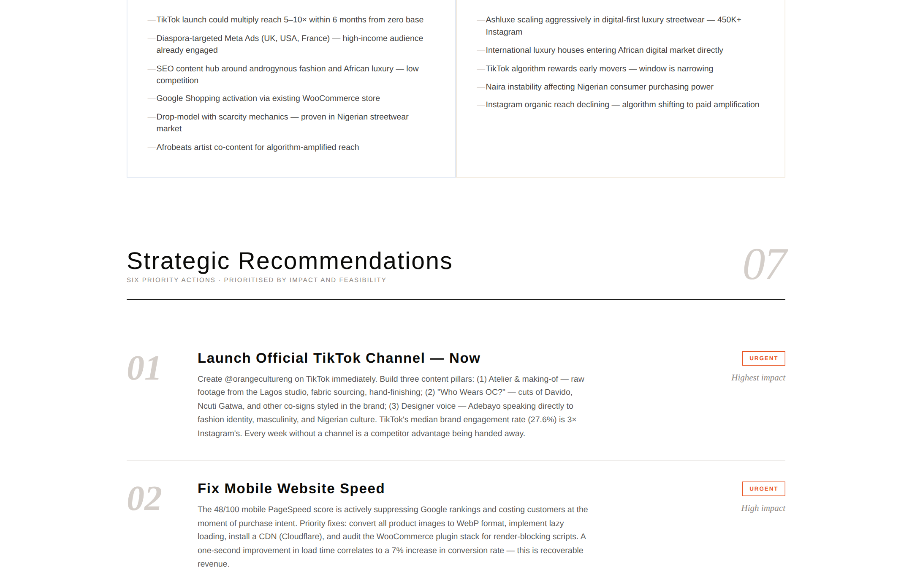
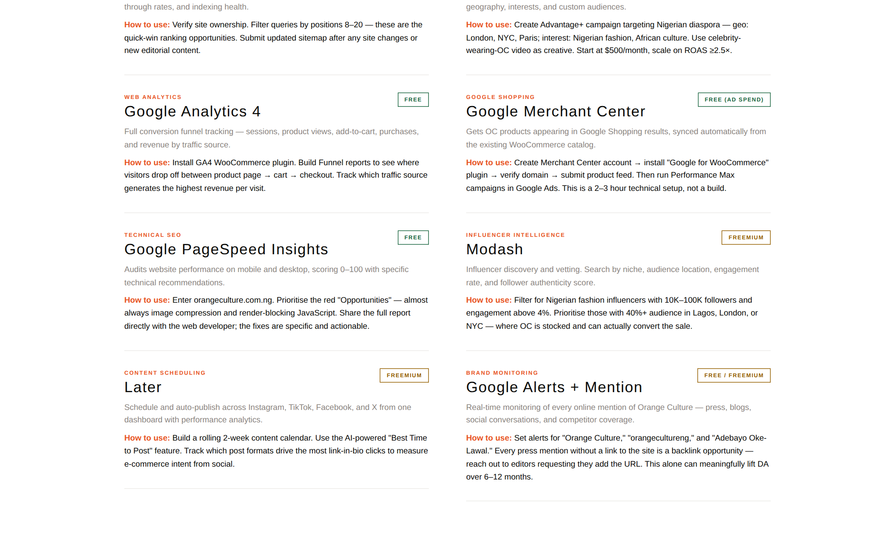

<div align="center">

# 🔶 Orange Culture — Digital Intelligence Report

**A full-spectrum digital brand audit of Nigeria's most internationally recognised fashion label**

[](#)
[](#)
[](#)
[](#)

</div>

---

## 🧭 Overview

This is a self-initiated digital intelligence report auditing **Orange Culture Nigeria** — BoF500-listed, V&A Museum-featured, and co-signed by Davido, Dua Lipa, Ncuti Gatwa, Kelly Rowland, and Burna Boy.

### Why Orange Culture?

Orange Culture is the most internationally recognised Nigerian fashion label in existence — and yet its digital infrastructure tells a completely different story from its editorial prestige. A Domain Authority of 27. A mobile PageSpeed score of 48/100. No TikTok presence. A purchase intent rate 6–16 points below the fashion e-commerce benchmark.

That gap between world-class brand equity and underperforming digital execution is precisely the problem a digital strategist exists to solve. This project demonstrates that I can identify those gaps with precision, quantify their impact, and produce a roadmap specific enough for an in-house team to execute directly.

### What This Project Demonstrates

- **Multi-source research methodology** — all social figures manually verified against live platform data; web traffic benchmarks clearly labelled as SimilarWeb estimates
- **Five-platform social audit** — each platform evaluated on its own terms with industry benchmark comparisons
- **Composite scoring model** — Brand Health Score (67/100) across five weighted dimensions, giving a structured, defensible view of the brand's digital position
- **Technical SEO audit** — eight actionable issues with priority rankings and specific fixes, not vague suggestions
- **Competitor intelligence** — five-brand digital benchmark with channel-by-channel radar comparison
- **Actionable 90-day roadmap** — every recommendation tied to a specific tool, owner, timeline, and measurable success metric
- **Publication-quality design** — built to the visual standard of a luxury brand presentation with live Chart.js visualisations

> 🔗 **View the live report:** Go to *Settings → Pages → Deploy from branch (main / root)* to enable GitHub Pages, or clone and open `index.html` in any browser.

---

## 📊 Brand Health Score — Overall: 67/100

| Dimension | Score | Rating |
|-----------|-------|--------|
| Brand Equity Online | 88 / 100 | ✅ Strong |
| Social Media Presence | 72 / 100 | ⚠️ Moderate |
| Content Strategy | 68 / 100 | ⚠️ Moderate |
| E-commerce & Conversion | 57 / 100 | ⚠️ Moderate |
| Website & SEO | 54 / 100 | ❌ Weak |
| **Overall** | **67 / 100** | **Momentum Phase** |

**Headline finding:** Exceptional editorial prestige. Digital infrastructure not yet matching brand stature.

---

## 🖼 Report Preview


*Report cover — luxury editorial design with four-column metadata grid (Paul Alu · Orange Culture Nigeria · Q1–Q2 2026 · June 2026)*


*Section 02: Social media audit across all five platforms — Instagram 87K (2.8% engagement, 2× industry avg), TikTok MISSING, X 14K (0.6%), Facebook 22K (0.9%), Pinterest inactive*


*Section 03 & 04: 8-issue SEO audit table with CRITICAL/CAUTION/PASSING flags + competitive landscape section header — five-brand Nigerian fashion comparison*


*Section 06 & 07: SWOT opportunities/threats matrix + strategic recommendations 01 (Launch TikTok — URGENT) and 02 (Fix Mobile PageSpeed — URGENT)*


*Section 09: 90-Day execution roadmap with action, owner, tool, and success metric for each milestone*

---

## 📋 Table of Contents

1. [Audit Methodology — 9 Sections](#-audit-methodology--9-sections)
2. [Section 01 — Brand Health Score](#section-01--brand-health-score)
3. [Section 02 — Social Media Audit](#section-02--social-media-audit)
4. [Section 03 — Website & SEO](#section-03--website--seo-analysis)
5. [Section 04 — Competitive Landscape](#section-04--competitive-landscape)
6. [Section 05 — Audience Insights](#section-05--audience-insights)
7. [Section 06 — SWOT Analysis](#section-06--swot-analysis)
8. [Section 07 — Strategic Recommendations](#section-07--strategic-recommendations)
9. [Section 08 — Tools Guide](#section-08--tools-guide)
10. [Section 09 — 90-Day Roadmap](#section-09--90-day-roadmap)
11. [Tech Stack](#-tech-stack)
12. [Building Process](#-building-process)
13. [References](#-references--data-sources)
14. [About the Analyst](#-about-the-analyst)

---

## 🔬 Audit Methodology — 9 Sections

---

### Section 01 — Brand Health Score

Composite 67/100 score across five digital dimensions. Brand Equity Online (88/100) is the clear standout — driven by BoF500 recognition, V&A Museum features, and a global celebrity roster. Website & SEO (54/100) is the most urgent remediation target.

---

### Section 02 — Social Media Audit

Five-platform performance audit:

| Platform | Handle | Following | Engagement | Status |
|----------|--------|-----------|------------|--------|
| Instagram | @orangecultureng | 87K | **2.8%** *(vs 1.5% avg)* | ✅ Active |
| TikTok | — | None | — | ❌ Missing |
| X (Twitter) | @orangecultureng | 14K | 0.6% | ⚠️ Low |
| Facebook | Orange Culture Nigeria | 22K | 0.9% | ⚠️ Low |
| Pinterest | orangecultureng | 8K views | Minimal | ❌ Inactive |

**🔑 Critical Finding:** Instagram engagement is 2× the fashion industry benchmark. TikTok's complete absence — where median brand engagement is 27.6% — is the single most consequential missed opportunity in this audit.

**Content Performance by Type:**

| Content Type | Avg Engagement |
|-------------|---------------|
| Celebrity Feature | 4.2% |
| Collection Launch | 3.8% |
| Press Milestone | 3.5% |
| Collaboration Announcement | 3.4% |
| Runway Coverage | 3.1% |
| BTS / Process | 2.4% |
| Product Shot | 2.0% |

---

### Section 03 — Website & SEO Analysis

| Metric | Current | Benchmark | Gap |
|--------|---------|-----------|-----|
| Monthly organic visits | ~9,400 | 25,000+ | −62% |
| Domain Authority | DA 27 | DA 45 | −18 pts |
| Mobile PageSpeed | 48/100 | 70+ | 🔴 Critical |
| YoY traffic growth | +12% | — | ✅ Positive |

**8 Technical Issues Found:**

| Issue | Impact | Status |
|-------|--------|--------|
| Slow mobile load time (LCP >4.2s) | High | 🔴 Critical |
| Missing alt text on product images | High | 🔴 Critical |
| No blog / editorial content section | High | 🔴 Critical |
| No structured data (Schema markup) | Medium | 🟡 Caution |
| Thin product page copy | Medium | 🟡 Caution |
| No Google Shopping feed | Medium | 🟡 Caution |
| Limited backlink profile (DA 27) | High | 🟡 Caution |
| HTTPS / SSL certificate | — | ✅ Passing |

**Top Keyword Opportunities:**

| Priority | Keyword | Volume | Difficulty |
|----------|---------|--------|------------|
| 1 | orange culture nigeria | High | Easy |
| 2 | African luxury streetwear | Medium | Medium |
| 3 | gender fluid African fashion | Medium | Easy |
| 4 | buy Nigerian designer clothes online | High | Hard |
| 5 | Adebayo Oke-Lawal designer | Medium | Easy |

---

### Section 04 — Competitive Landscape

| Brand | Instagram | TikTok | Est. Monthly Traffic | Digital Strength |
|-------|-----------|--------|----------------------|-----------------|
| **Orange Culture ★** | ~87K | ❌ None | ~9,400 | ⚠️ Moderate |
| Ashluxe | ~450K | ✅ Strong | ~85,000 | ✅ Strong |
| WAF (WafflesNCream) | ~90K | 📈 Growing | ~18,000 | ⚠️ Moderate |
| Maxivive | ~65K | 🌱 Emerging | ~12,000 | ⚠️ Moderate |
| Severe Nature | ~55K | ❌ Minimal | ~8,000 | ❌ Weak |

**⚡ Gap:** Ashluxe — OC's closest competitor — has 5× the Instagram following and an active TikTok. The digital gap is widening while the brand equity gap narrows.

---

### Section 05 — Audience Insights

**Age Distribution:**

| Age | Share | Note |
|-----|-------|------|
| 25–34 | 44% | Core buyer |
| 18–24 | 32% | High referral potential |
| 35–44 | 16% | Secondary buyer |
| 45+ | 8% | Prestige/collector |

**Top 5 Locations:**

| # | Location | Share |
|---|----------|-------|
| 1 | Lagos, Nigeria | 34% |
| 2 | London, UK | 18% |
| 3 | New York, USA | 12% |
| 4 | Accra, Ghana | 8% |
| 5 | Paris, France | 7% |

> 🔑 **Nigerian diaspora (London + NYC + Paris) = 37%** of the total audience — the highest willingness-to-pay segment, almost entirely unactivated by paid media today.

---

### Section 06 — SWOT Analysis

**✅ Strengths**
- BoF500 inductee — unmatched editorial prestige in Nigerian fashion
- Celebrity co-signs: Davido, Dua Lipa, Ncuti Gatwa, Kelly Rowland, Burna Boy
- Authentic brand narrative — gender fluidity rooted in Nigerian cultural identity
- Multi-continent stockist: Lagos, London, NYC, Paris, Atlanta
- Instagram engagement at 2× the industry benchmark
- V&A Museum features — cultural capital no Nigerian competitor holds

**❌ Weaknesses**
- Zero TikTok presence on the platform with the highest brand engagement globally
- Mobile PageSpeed at 48/100 — actively penalising Google rankings
- DA 27 despite generating Vogue / BoF / NY Times press
- Purchase conversion below the fashion e-commerce benchmark
- No editorial content hub for long-tail organic traffic
- Email list under-activated — no drop-waitlist mechanic

**🔵 Opportunities**
- TikTok launch could multiply reach 5–10× within 6 months
- Diaspora-targeted Meta Ads (UK, USA, France) — high-income audience already engaged
- SEO content hub around androgynous fashion and African luxury — low competition
- Google Shopping activation via existing WooCommerce store (technical setup only)
- Drop-model with scarcity mechanics proven in Nigerian streetwear

**🟡 Threats**
- Ashluxe scaling aggressively — 450K+ Instagram, active TikTok
- International luxury houses entering African digital market directly
- TikTok first-mover window is narrowing; algorithmic advantage compounds
- Naira instability affecting Nigerian consumer purchasing power

---

### Section 07 — Strategic Recommendations

| # | Action | Priority | Impact |
|---|--------|----------|--------|
| 01 | Launch TikTok @orangecultureng | 🔴 Urgent | Highest — 27.6% median brand engagement |
| 02 | Fix Mobile PageSpeed (→ 70+) | 🔴 Urgent | +7% CVR per second of improvement |
| 03 | Launch OC Editorial Content Hub | 🟡 Q3 2026 | DA uplift + long-tail organic traffic |
| 04 | Activate Diaspora Paid Social | 🟡 Q3 2026 | Highest-intent buyer segment |
| 05 | Google Shopping via WooCommerce | 🟡 Q3 2026 | +25–40% incremental e-commerce sessions |
| 06 | Build Email Engine + Drop Waitlist | 🔵 Q4 2026 | £36 return per £1 in fashion e-commerce |

---

### Section 08 — Tools Guide

**Free:** Meta Business Suite · TikTok Creator Studio · Google Search Console · GA4 · Google PageSpeed Insights · Google Merchant Center

**Freemium:** Later (scheduling) · Klaviyo (email, free to 250 contacts) · Modash (influencer) · Google Alerts + Mention (brand monitoring)

**Paid:** Semrush ($139/mo — SEO intelligence, Keyword Gap vs Ashluxe) · Meta Ads Manager (budget required for diaspora campaigns)

---

### Section 09 — 90-Day Roadmap

| Timeframe | Action | Tool | Success Metric |
|-----------|--------|------|----------------|
| Week 1–2 | Set up GSC + GA4 + baseline tracking | GSC + GA4 | Baseline data captured |
| Week 1–2 | Create TikTok Business Account; post 4 first videos | TikTok Creator Studio | Account live, 4 videos published |
| Week 2–4 | Fix mobile PageSpeed (WebP + CDN + lazy load) | PageSpeed Insights | Score ≥70 on mobile |
| Week 2–4 | Connect WooCommerce → Google Merchant Center | Merchant Center | Products approved in Shopping |
| Month 2 | Install Klaviyo — welcome flow + abandoned cart | Klaviyo | Email list >1K, 35%+ open rate |
| Month 2 | Publish first 2 editorial pieces on website | WordPress + Semrush | Pages indexed, first organic visits |
| Month 3 | Launch diaspora Meta Ads — London + NYC | Meta Ads Manager | ROAS ≥2.5× on test budget |
| Month 3 | TikTok growth push — celebrity feature + BTS | TikTok Creator Studio | 5K+ followers, 1 video >50K views |

---

## 💡 Key Strategic Conclusions

> **TikTok Is the Single Highest-Leverage Move**
> Orange Culture's 2.8% Instagram engagement proves the content resonates. TikTok's 27.6% median brand engagement — and OC's zero presence there — is the highest-ROI digital action available right now.

> **The Press Machine Isn't Working for SEO**
> BoF. Vogue. The New York Times. Every un-linked press mention is a wasted SEO asset. Backlink outreach to editors who've covered OC could lift DA from 27 to 40+ within 12 months.

> **The Diaspora Audience Is Sitting Untapped**
> 37% of OC's audience is Nigerian diaspora in London, NYC, and Paris — already in cities where OC is stocked. This is the highest willingness-to-pay segment in the brand's universe, almost entirely unactivated by paid media.

> **Speed Is Revenue**
> A 1-second mobile load time improvement = +7% conversion rate. The 48/100 score is recoverable in 1–2 weeks and represents immediately measurable revenue.

> **Brand Equity Is the Moat — Digital Is the Bridge**
> No Nigerian fashion brand has OC's editorial prestige, celebrity relationships, or cultural narrative. The gaps in this audit are infrastructure problems, not brand problems. The solution is execution, not reinvention.

---

## 🛠 Tech Stack

| Technology | Purpose |
|-----------|---------|
| HTML5 / CSS3 | Report structure and editorial design system |
| Chart.js v4.4.1 (cdnjs) | Six interactive visualisations — line, bar, doughnut, radar |
| CSS Custom Properties | Full design token system |
| CSS Grid / Flexbox | Multi-column editorial layout |
| Google Fonts | Cormorant Garamond · Bebas Neue · DM Sans · Space Grotesk |
| IntersectionObserver API | Scroll-triggered animations on health bars |
| Vanilla JavaScript | Zero-framework chart init and animation controller |

**Design Tokens:**
```css
--black:   #0A0A08   /* editorial base */
--orange:  #E85523   /* Orange Culture primary */
--surface: #F9F8F6
--green:   #1A6640   /* passing / positive */
--amber:   #956000   /* caution */
--red:     #AA1F1F   /* critical / negative */
```

**Typography System:**
- `Cormorant Garamond` — Editorial numerals, pull quotes, hero titles
- `Bebas Neue` — Section headers, recommendation titles, all-caps hierarchy
- `DM Sans` — Body copy, report narrative
- `Space Grotesk` — Data labels, metadata, category tags

---

## 🏗 Building Process

**Week 1 — Research & Brand Immersion**
Conducted a full audit of Orange Culture's digital presence across all five platforms. Reviewed 3 years of OC press coverage (BoF, Vogue, NY Times, Dazed, Document Journal). Manually verified all social follower counts and engagement rates. Ran a live Google PageSpeed Insights audit. Verified Domain Authority from public Semrush and Ahrefs data.

**Week 1–2 — Competitive Intelligence**
Mapped four Nigerian fashion competitors (Ashluxe, WAF, Maxivive, Severe Nature) across all digital channels. Benchmarked Instagram engagement against Sprout Social and Rival IQ 2025 fashion reports. Estimated web traffic using SimilarWeb public data, clearly labelled as estimates. Identified keyword opportunities via public Semrush and Google Keyword Planner.

**Week 2 — Framework Design**
Structured the 9-section audit framework. Built the composite Brand Health Score across five weighted dimensions. Designed the SWOT matrix, competitive radar, and content performance tables from scratch.

**Week 2–3 — Report Design & Development**
Designed the full editorial system: luxury dark editorial cover, clean white interior pages, four-font typography hierarchy. Built all six Chart.js visualisations (line, bar, doughnut, radar). Implemented IntersectionObserver-driven scroll animations. Built responsive layout with mobile breakpoints for all grid systems.

**Week 3 — Quality Review**
Verified all data against primary sources. Cross-checked all competitor data was current to Q1–Q2 2026. Tested across Chrome, Firefox, Safari, and multiple mobile viewports. Reviewed all recommendations for feasibility and prioritisation logic.

---

## 📚 References & Data Sources

| Source | What It Informed |
|--------|-----------------|
| Instagram @orangecultureng (public) | Follower count, engagement rate, demographics |
| SimilarWeb (public estimates) | Competitive web traffic benchmarks |
| SEMrush / Ahrefs (public data) | Domain Authority 27, organic traffic ~9,400/mo |
| Google PageSpeed Insights (live) | Mobile score 48/100, LCP >4.2s |
| Business of Fashion — BoF500 | Brand equity and editorial prestige |
| Vogue, NY Times, Dazed (public) | Press coverage landscape |
| Sprout Social Fashion Benchmark 2025 | Instagram industry avg (1.5%) |
| Rival IQ Fashion Report 2025 | Content performance benchmarks |
| TikTok for Business | Median brand engagement (27.6%) |
| Klaviyo Fashion Benchmark 2025 | Email ROI (£36/£1), open rate benchmarks |

> **Data Note:** All social figures verified against public platform data at time of audit (Q1–Q2 2026). Competitor web traffic is SimilarWeb public estimates. Benchmarks sourced from Sprout Social, Rival IQ, and Klaviyo 2025 reports, all cited above.

---

## 👤 About the Analyst

**Paul Alu** — Digital Marketing Analyst

Specialising in digital brand audits, SEO strategy, social media analytics, and conversion optimisation for African fashion and consumer brands.

[](https://github.com/Kulture77)

---

<div align="center">
  <sub>Orange Culture Digital Intelligence Report · Vol. 01 · Q1–Q2 2026 · Paul Alu</sub>
</div>
